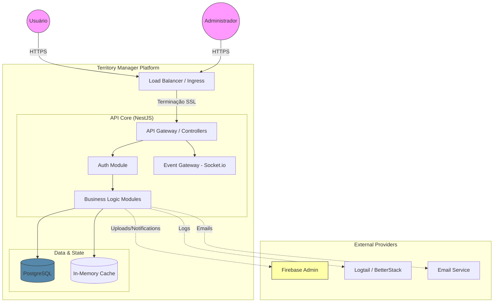

# Território Digital (Territory Manager)

> **Gestão Digital de Territórios: Rápido, Simples e Eficiente.**

O **Território Digital** é uma plataforma moderna projetada para auxiliar congregações na gestão de territórios. O sistema resolve problemas comuns como extravio de registros em papel, dificuldade na localização de quadras e limitações no controle de visitas ("repescagens").

🌐 **Site Oficial:** [td.territory-manager.com.br](https://td.territory-manager.com.br)  
📱 **Demo:** [Faça um teste online](https://app.territory-manager.com.br/home?p=territorio%2F3%3Fround%3D7&s=c6b85860-76b2-4b0e-a8a4-66afc68d926c)

---

## 🚀 Principais Recursos

### Para Quem Gerencia (Administração)
- **Controle Centralizado:** Gerencie territórios, quadras, ruas e casas em um painel unificado.
- **Links Seguros:** Gere links de acesso temporário para dirigentes e publicadores, sem necessidade de login/senha para usuários finais.
- **Auditabilidade:** Histórico completo de quem trabalhou em qual território e quando (`Records Module`).
- **Backup Diário:** Segurança dos dados garantida.

### Para Quem Usa (Campo)
- **Marcação em Tempo Real:** Atualizações via WebSocket mostram instantaneamente casas visitadas ou "não em casa" para todos no mesmo território.
- **Mapas Integrados:** Integração nativa com Google Maps para localização exata.
- **Sem Coleta de Dados Pessoais:** Foco na estrutura do território, respeitando a privacidade.

---

## 🏗️ Arquitetura do Sistema

O sistema é uma API RESTful robusta construída com **NestJS**, seguindo uma arquitetura modular e orientada a eventos.

### Visão Macro (Container Diagram)



### Stack Tecnológico

*   **Backend Framework:** [NestJS](https://nestjs.com/) (Node.js)
*   **Database:** PostgreSQL 14+ (via Prisma ORM)
*   **Real-time:** Socket.io (WebSockets)
*   **Infrastructure:** Docker & Docker Compose
*   **Cloud Services:** Firebase (Storage/Push), Logtail (Logging)

---

## 🛡️ Qualidade de Código (Testes)

O projeto mantém um alto padrão de confiabilidade, com cobertura abrangente de testes de integração (E2E).

| Métrica | Cobertura |
| :--- | :--- |
| **Statements** | 83% |
| **Functions** | 79% |
| **Lines** | 85% |
| **Tests Passed** | 113/113 |

Executamos testes E2E rigorosos para garantir que fluxos críticos como **Assinatura de Territórios**, **Atualização de Rodadas** e **WebSockets** funcionem perfeitamente.

---

## 🧩 Módulos Principais

A aplicação é dividida em contextos de negócio para facilitar a manutenção e escalabilidade.

### 1. Colaboração em Tempo Real (Gateway Module)
Gerencia a presença dos usuários nos territórios.
*   **Funcionalidade:** Quando um usuário abre um território, ele entra em uma "Sala" (Room).
*   **Sincronização:** Se um usuário marca uma casa como visitada, todos na mesma sala recebem a atualização instantaneamente.
*   **Mecanismo:** WebSockets com autenticação JWT e persistência de estado de sessão para recuperação de falhas.

### 2. Acesso Efêmero (Signature Module)
Permite que publicadores acessem o sistema sem criar conta.
*   **Tokens Temporários:** O sistema gera URLs únicas com validade definida (ex: 5 horas).
*   **Segurança:** Utiliza JSON Web Tokens (JWT) assinados que expiram automaticamente.

### 3. Analytics e Relatórios (Dashboard & Records)
*   **Dashboard:** Visão gerencial com estatísticas de cobertura do território.
*   **Records:** Auditoria histórica de designações para o secretário da congregação.

---

## 💻 Desenvolvimento e Instalação

### Pré-requisitos
*   Docker & Docker Compose
*   Node.js 18+ (para desenvolvimento local sem Docker)

### Configuração Inicial

1.  **Clone o repositório:**
    ```bash
    git clone https://github.com/seu-usuario/territory-manager.git
    cd territory-manager
    ```

2.  **Configure as variáveis de ambiente:**
    Copie o arquivo de exemplo (se houver) ou crie um `.env` com base no `docker-compose.yml`.

3.  **Inicie o ambiente (Docker):**
    ```bash
    # Inicia App e Banco de Dados em modo de desenvolvimento
    npm run docker:app:dev
    ```
    A API estará disponível em `http://localhost:3000`.

### Comandos Úteis

| Comando | Descrição |
| :--- | :--- |
| `npm run start:dev` | Roda a API localmente (watch mode) |
| `npm run test` | Executa testes unitários |
| `npm run test:e2e` | Executa testes ponta-a-ponta |
| `npm run docker:db:dev` | Sobe apenas o banco de dados via Docker |
| `npm run prisma:studio` | Abre interface visual para o banco de dados |

---

## 📞 Suporte e Contato

Dúvidas ou sugestões? Entre em contato através do nosso canal oficial.

*   [WhatsApp de Suporte](https://wa.me/5515981785706)
*   [Website Oficial](https://td.territory-manager.com.br)

---

## ☕ Pague o meu café

Este projeto é desenvolvido com carinho para ajudar congregações. Se ele tem sido útil para você, considere fazer uma doação para ajudar nos custos do servidor e do desenvolvimento.

[](https://www.paypal.com/donate/?hosted_button_id=VKVMUKKR6QCSA&locale.x=pt_BR)

---

© 2025 Território Digital. Todos os direitos reservados.
